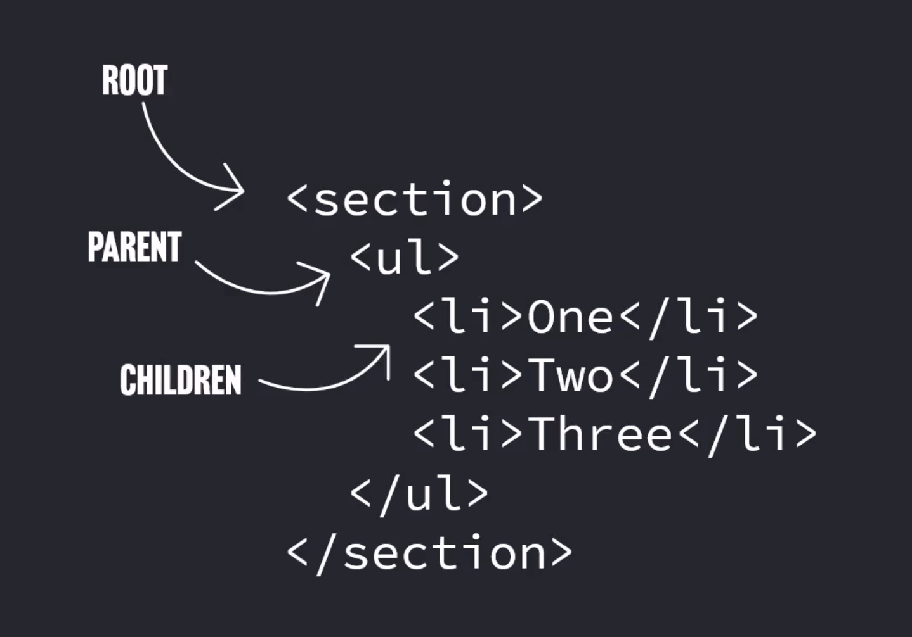
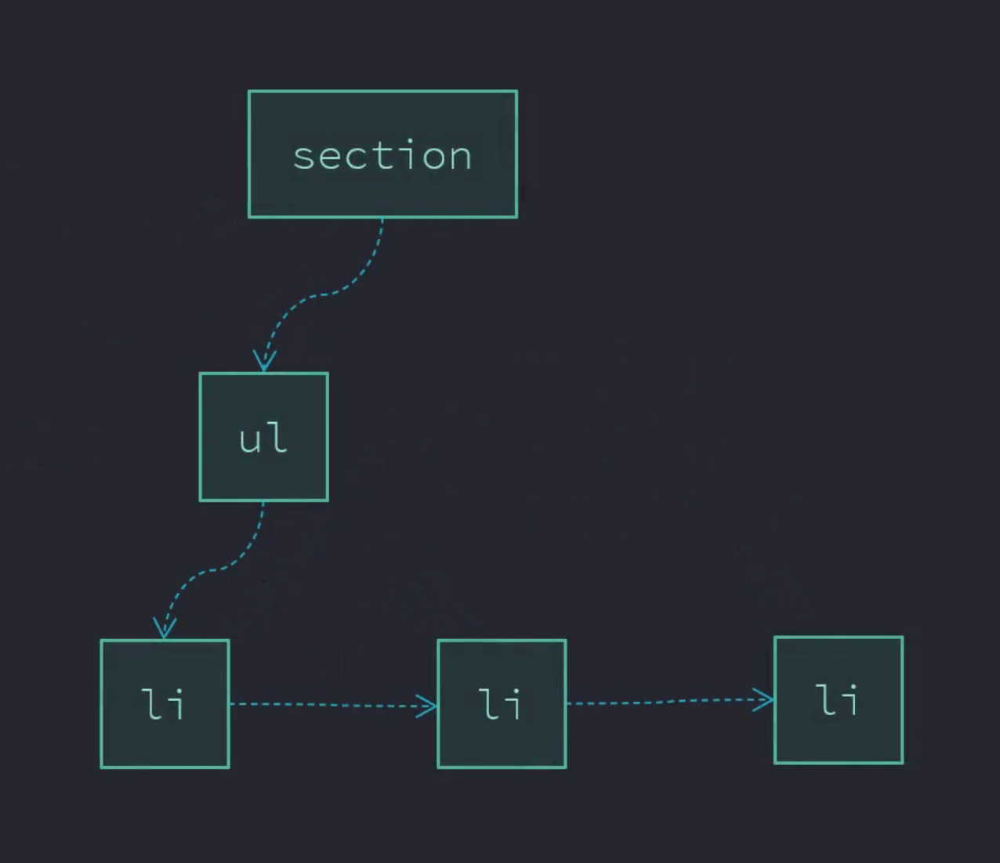
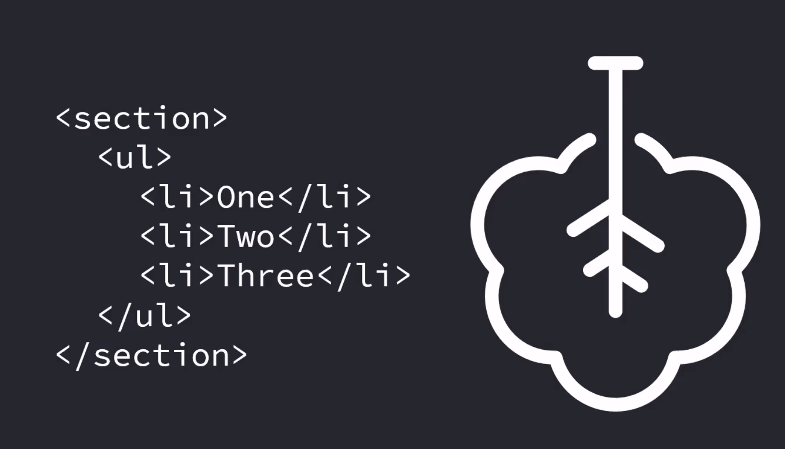
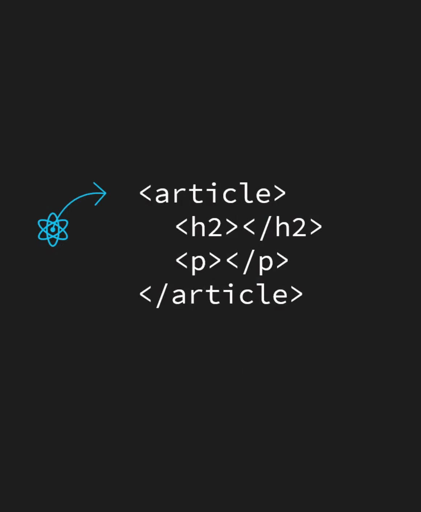
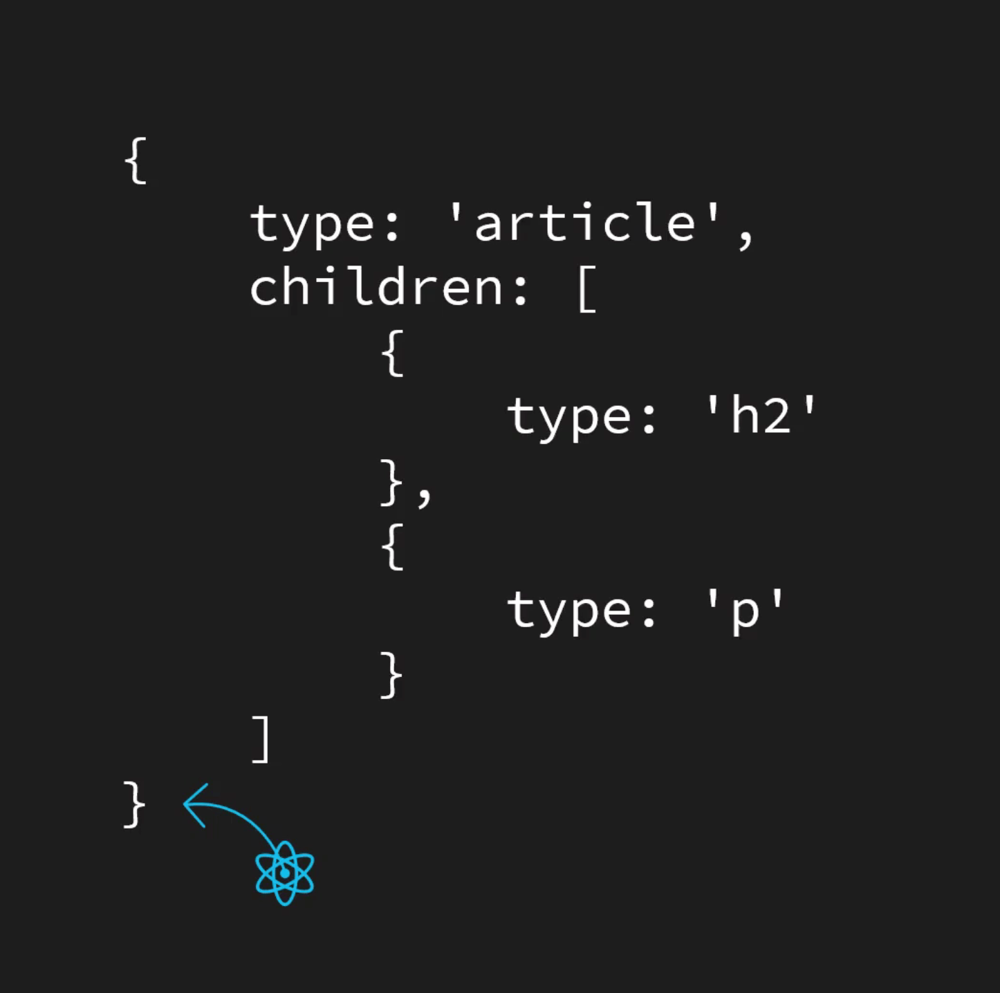
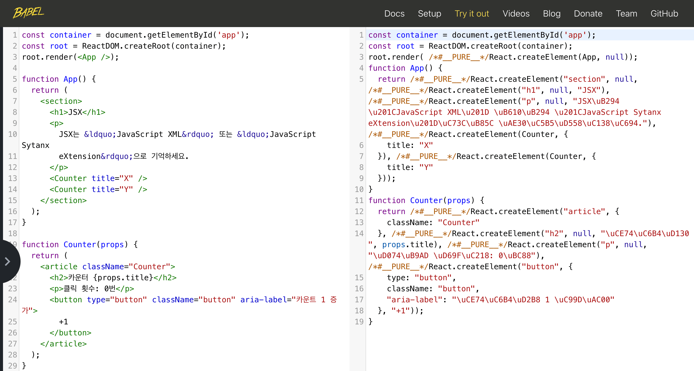

# 마크업 & 트리

HTML 마크업은 트리 구조이고, 트리를 구조화하기 가장 좋은 방법입니다.  
개발자가 트리를 구조화하기 가장 좋은 방법은 HTML과 같은 문법을 사용하는 것입니다.  
만약 JavaScript 구문에서 이러한 방법을 사용할 수 있다면 효과적일 것입니다.

  

---

# 트랜스파일러 (Transpiler)

특정 구문으로 작성된 코드를, 동일한 작업을 수행하는  
다른 구문으로 변환(transform)하는 것을 트랜스파일러 또는 트랜스포머라고 부릅니다.

 

---

# JSX

[JSX](https://facebook.github.io/jsx/)는 XML과 유사한 문법을 사용하는 ECMAScript를 구문 확장합니다.
HTML과 달리, 별도 의미를 가지지는 않습니다. (의미 없는 마크업)

단지, 트리 구조를 태그를 사용해 더 편리하게 구성하는 방법일 뿐입니다.

```jsx
const box = (
  <Box>
    {
      shouldShowAnswer(user) ?
      <Answer value={false}>아니오</Answer> :
      <Box.Comment>
         텍스트 콘텐츠
      </Box.Comment>
    }
  </Box>
)
```

---

# JSX 트랜스파일러

[Babel](https://babeljs.io)은 JSX → JavaScript 코드로 변환하는 도구입니다.

[](https://bit.ly/45xbTUz)

---

# Babel Standalone

[@babel/standalone](https://babeljs.io/docs/babel-standalone)은 브라우저 환경에서 사용 가능한 [독립형 Babel 빌드 도구](https://unpkg.com/@babel/standalone/babel.min.js)입니다.

##### 실습

☑ @babel/standalone 호출

```html
<script src="https://unpkg.com/@babel/standalone/babel.min.js" crossorigin></script>
```

☑ JSX 트랜스파일링

```html
<script src="./main.js" type="text/jsx"></script>
```

---

# Vite

차세대 프론트엔드 도구인 [Vite](https://ko.vitejs.dev)는 기본적으로 [JSX를 JavaScript 코드 변환 기능을 제공](https://ko.vitejs.dev/guide/features.html#jsx)합니다.

##### 실습

☑ 파일 확장자 `.js` → `.jsx` 변환

```html
<script src="./main.jsx"></script>
```

---

# JSX 마크업

JSX 구문을 사용해 마크업을 더 편리하게 작성합니다.

##### 실습

☑ JavaScript 코드를 JSX 구문으로 변경
☑ 컴포넌트 속성(props) 구조 분해 할당

---

# HTML 마크업

JSX 구문은 의미를 가지지 않지만, HTML은 의미를 가집니다.
올바른 HTML 작성은 올바르게 웹 문서를 구조화하므로 매우 중요합니다.

### <div> 남용 문제

<div> 요소는 아무런 의미를 가지지 않습니다.

개발자는 적합한 다른 요소가 없을 경우에만, 최후의 수단 <div> 요소를 사용해야 합니다.  
더 적절한 요소를 사용하면 사용자의 접근성이 향상되고 개발자는 유지 관리하기 더 쉽습니다.

##### 실습

☑ JSX 사용 시, 발생 가능한 일반적인 실수 상황 검토

---

# 올바른 의미 구조화

<div> 요소를 남용하지 않고, 의미에 부합하는 적절한 요소 사용이 권장됩니다.  

웹 표준과 접근성을 고려한 설계가 사용자에게 매우 중요함을 잊어서는 안됩니다.

##### 실습

☑ 웹 표준을 준수한 문제 해결 방법
☑ [<React.Fragment>](https://facebook.github.io/jsx/#prod-JSXFragment)를 사용한 해결 ([참고](https://ko.react.dev/reference/react/Fragment))