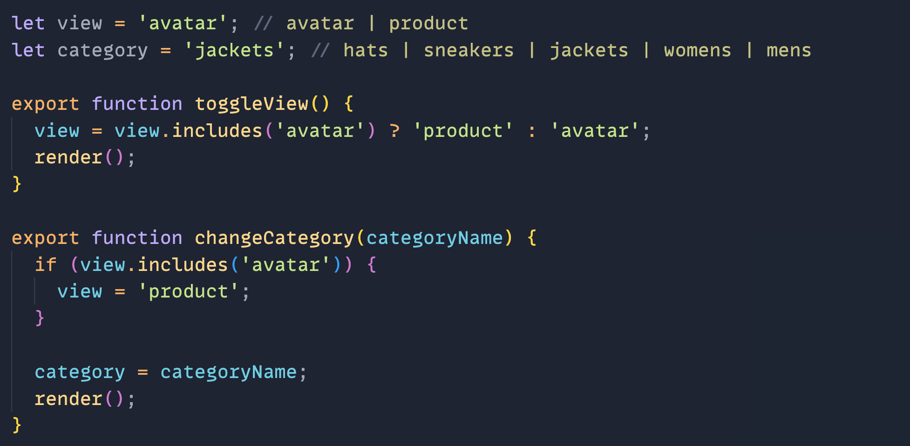
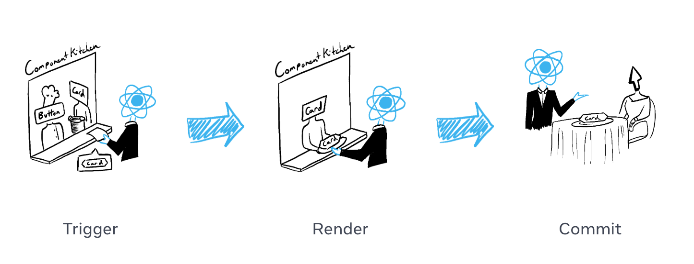
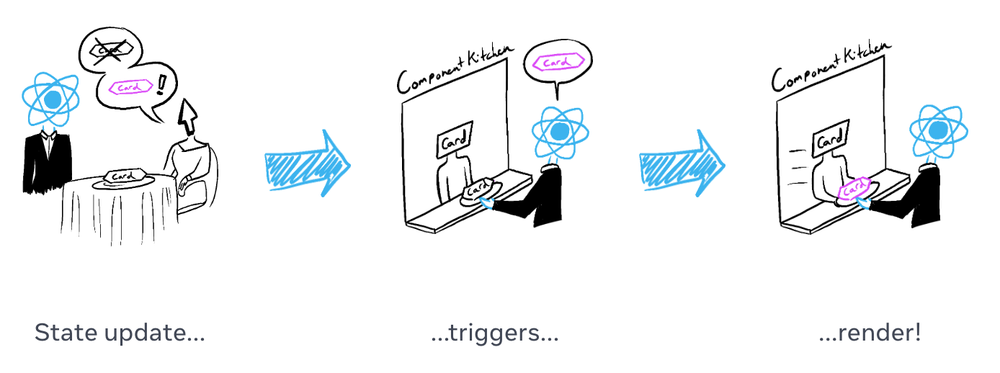
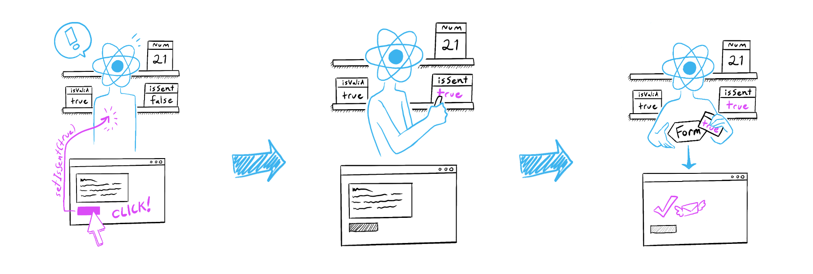
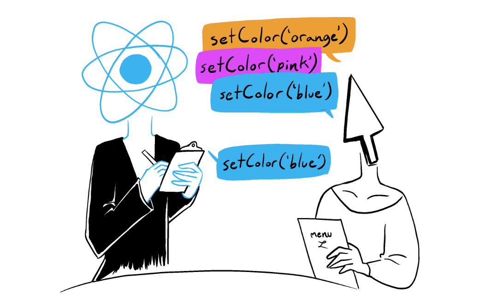
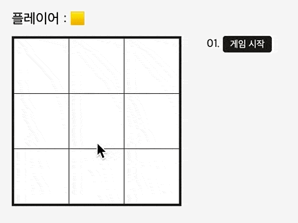

# 이벤트 핸들링

React 앱은 React API 또는 JSX 구문에 이벤트 핸들러를 추가할 수 있습니다. 
이벤트 핸들러는 클릭, 마우스 호버, 폼 인풋 등 사용자에 의해 실행되는 사용자 정의 함수입니다.

- 인라인 함수 설정
- 정의된 함수 연결
- 속성(prop)으로 전달
- 접근성 준수 ([참고](https://developer.mozilla.org/ko/docs/Learn/Accessibility/HTML))
- 이벤트 전파, 전파 중지 ([참고](https://ko.react.dev/learn/responding-to-events#event-propagation))
- 기본 작동 방지 ([참고](https://ko.react.dev/learn/responding-to-events#preventing-default-behavior))
- 사이드 이펙트 실행 가능 ([참고](https://ko.react.dev/learn/responding-to-events#can-event-handlers-have-side-effects))

---

# 컴포넌트 상태 설정

컴포넌트는 현재 주어진 데이터를 "기억"해야 합니다. 
React는 이런 컴포넌트 메모리를 상태(state)라고 부릅니다. ([참고](https://ko.react.dev/learn/state-a-components-memory))

- React 월드에서 'use'로 시작하는 모든 함수는 훅(hook)
- `React.useState()` 훅을 사용해 컴포넌트 상태 설정
- `useState()` 훅이 반환하는 한 쌍의 데이터 값에 대한 이해
- 컴포넌트 상태는 컴포넌트 인스턴스에서 사용 가능한 로컬 메모리
- 컴포넌트 상태는 하위 컴포넌트에 속성(prop)으로 전달 가능
- 하위 컴포넌트는 상위 컴포넌트의 상태를 직접 변경할 수 없음

---

# [실습] 컴포넌트 상태 설정 / 이벤트 핸들링

현재 작성된 `main.jsx`에서 사용된 지역 변수 `view`, `category` 및 
`toggleView`, `changeCategory` 함수는 올바른 React 프로그래밍 코드가 아닙니다.
이를 React 상태 및 이벤트 제어 방법을 사용해 React의 방식으로 프로그래밍을 수정합니다.




---

# 렌더 & 커밋

React의 렌더링 단계는 다음과 같습니다. ([참고](https://ko.react.dev/learn/render-and-commit))

1. 렌더 트리거
1. 컴포넌트 렌더링
1. DOM 커밋 



---

# 렌더 트리거

컴포넌트 최초 렌더링 후, 상태 업데이트 함수를 사용해 렌더 트리거(요청)할 수 있습니다. 
컴포넌트 상태가 업데이트 되면 렌더 큐(대기열)에 자동 추가됩니다. ([참고](https://ko.react.dev/learn/render-and-commit#re-renders-when-state-updates))



---

# 컴포넌트 렌더링

렌더 트리거(요청)되어 리-렌더링되면 React에서 컴포넌트(함수)를 다시 호출합니다.

1. 최초 렌더링 → DOM 노드 생성 및 마운트
1. 리-렌더링 → 이전 렌더링 결과와 비교 (커밋 이전까지 아무 작업 안함)

### 주의사항

1. 렌더링은 항상 순수해야 함 → 동일 입력 동일 출력 요구 됨
1. 렌더링 전에 존재하는 객체 및 변수를 수정(mutation)해서는 안됨

---

# DOM 커밋

컴포넌트 렌더링(함수 호출) 이후, React는 DOM을 업데이트합니다.

1. 최초 렌더링 → DOM API를 사용해 DOM 생성
1. 리-렌더링 → 이전 렌더링 결과 비교, 변경된 부분만 DOM 업데이트

---

# 브라우저 페인팅

컴포넌트 렌더링 완료 후, React는 DOM을 업데이트합니다. 
DOM이 업데이트 되면 브라우저는 화면을 다시 그립니다.

사실 "브라우저 렌더링"이라고 해야 맞지만, 컴포넌트 렌더링과
혼동할 우려가 있어 React에서는 "브라우저 페인팅"이라고 부릅니다. ([참고](https://ko.react.dev/learn/render-and-commit#epilogue-browser-paint))


---

# 스냅샷처럼 작동하는 상태 

React의 상태(state)는 스냅샷(snapshot)처럼 동작합니다. 
렌더링 중 상태는 변경되지 않습니다. 다만, 상태 변경을 React에 요청할 뿐입니다.

1. 상태 업데이트 함수가 실행되면 렌더 트리거됩니다.
1. 렌더 트리거 이후, 컴포넌트가 렌더링(함수 재호출)됩니다.
1. 컴포넌트 렌더링 이후, DOM 커밋되어 화면을 업데이트합니다.

---

# 렌더링 = 현 시점의 스냅샷

렌더링이란? "React가 함수를 호출하는 것"을 말합니다.
해당 함수에서 반환하는 JSX는 "화면의 현재 스냅샷"과 같습니다. ([참고](https://ko.react.dev/learn/state-as-a-snapshot#rendering-takes-a-snapshot-in-time))

1. 상태 업데이트 요청 (상태 안바뀜)
1. 컴포넌트 리-렌더링 (변경된 상태 전달)



---

# 상태 업데이트 큐

React 상태를 설정하면 다음 렌더링이 큐(queue, 대기열)에 추가됩니다.
하지만 때로는 다음 렌더링을 큐에 넣기 전에, 여러 작업을 일괄 수행하고 싶을 수도 있습니다.

---

## 배치 업데이트 (Batchs update)

컴포넌트 렌더링 시점에서 상태는 변경되지 않죠. 스냅샷처럼 작동하기 때문입니다.
그리고 React는 모든 상태 업데이트 함수가 호출되기 전까지 리-렌더링하지 않습니다.
컴포넌트 리-렌더링은 모든 함수가 호출된 이후 처리됩니다. ([참고](https://ko.react.dev/learn/queueing-a-series-of-state-updates#react-batches-state-updates))



---

## 렌더링 중, 상태 업데이트를 여러 번 요청

흔하지는 않지만, 현 시점의 렌더링(스냅샷)에서 상태 변경을 여러 번 요청하도록 할 수 있습니다.
이런 경우 다음에 변경될 상태 값이 아니라, 아래처럼 콜백 함수를 설정합니다. ([참고](https://ko.react.dev/learn/queueing-a-series-of-state-updates))

```jsx 
const [state, setState] = useState('');

setState((prevState) => prevState + '💛'); // '💛'
setState((prevState) => prevState + '💛'); // '💛💛'
setState((prevState) => prevState + '💛'); // '💛💛💛'
```

---

# 객체형 상태 업데이트

JavaScript의 원시형 데이터는 모두 "변경 불가능(immutable)"합니다.
반면, JavaScript의 객체형 데이터는 "변경 가능(mutable)"합니다.

−

React 상태는 JavaScript의 모든 데이터를 값으로 가질 수 있습니다.
하지만 원시형이 아닌, 객체형 데이터를 상태 값으로 할 경우 직접 수정해서는 안됩니다.
상태 값인 객체를 업데이트 하려면 새로운 객체 생성 또는 복사본을 만들어야 합니다.

상태 업데이트 함수 실행 없이, 직접 값을 수정할 경우 React는 변경 유무를 알 수 없습니다. 
**React가 아무 것도 알 수 없으므로 아무런 반응이 일어나지 않습니다.**

React 상태는 스냅샷처럼 작동하므로 항상 "읽기 전용(readonly)"으로 다루세요. ([참고](https://ko.react.dev/learn/updating-objects-in-state#treat-state-as-read-only))

---

## 상태 업데이트 (객체)

JavaScript 객체를 복사해 새 객체를 생성하는 방법은 다양합니다.
그 중 전개 구문을 사용하는 것이 가장 간단합니다.

```js
// 복제된 새로운 객체 설정
const nextState = setState({ ...state, /* ... */ });


// 콜백을 사용해 이전 상태 객체를 복제하여 새로운 객체 반환
const nextState = setState((prevState) => {
  // ...
  return { ...prevState, /* ... */ };
})
```

---

### 상태의 중첩된 객체 업데이트 (객체)

전개 구문은 "얕은 복사(shallow copy)"를 수행하므로 중첩된 객체는 여전히 참조됩니다.
그러므로 중첩된 객체 또한 복사본을 사용해야 합니다.

```js
setState({
  ...state, // 상태 복사본
  nestedObject: { // 상태 객체의 속성 (중첩된 객체)
    ...state.nestedObject, // 중첩된 객체 복사본
    /* ... */ // 중첩된 객체의 속성 값 변경
  }
});
```

---

### Immer 라이브러리 활용

[use-immer](https://github.com/immerjs/use-immer) 훅을 사용하면 중첩된 객체 업데이트를 보다 손쉽게 할 수 있습니다. ([참고](https://ko.react.dev/learn/updating-objects-in-state#write-concise-update-logic-with-immer))

#### 패키지 설치

```sh
pnpm add immer use-immer
```

#### 사용법

```jsx
const [state, useState] = useImmer({ /* ... */ });

useState((draft) => {
  draft.nestedObject.description = '중첩 상태 쉽게 바꾸기';
});
```

---

## 상태 업데이트 (배열)

객체처럼, 배열 또한 React의 상태 값인 경우 동일 처리가 필요합니다.
배열 값 변경 없이, 새 배열 생성 또는 복사본을 사용해 상태 값으로 업데이트해야 합니다. ([참고](https://ko.react.dev/learn/updating-arrays-in-state#updating-arrays-without-mutation))

#### 배열을 변경하지 않는 메서드

React에서는 배열을 직접 수정하지 않는 메서드를 사용해야 합니다.

- [map()](https://developer.mozilla.org/ko/docs/Web/JavaScript/Reference/Global_Objects/Array/map)
- [filter()](https://developer.mozilla.org/ko/docs/Web/JavaScript/Reference/Global_Objects/Array/filter)
- [slice()](https://developer.mozilla.org/ko/docs/Web/JavaScript/Reference/Global_Objects/Array/slice)
- [toSorted()](https://developer.mozilla.org/ko/docs/Web/JavaScript/Reference/Global_Objects/Array/toSorted)
- [toReversed()](https://developer.mozilla.org/ko/docs/Web/JavaScript/Reference/Global_Objects/Array/toReversed)

---

## 상태 값인 배열 업데이트 방법

React의 상태로서 배열 데이터를 업데이트 하는 방법을 학습합니다.

- 추가(add)
- 수정(edit)
- 교체(replace)
- 삽입(insert)
- 삭제(remove)
- 정렬(sort)

---

### 추가 

배열에 새 항목을 추가하는 가장 쉬운 방법은 전개 구문입니다.

```jsx
// 뒤에 새 항목 추가
setState([...state, newItem]);

// 앞에 새 항목 추가
setState([newItem, ...state]);
```

### 수정

map 메서드를 사용해 배열 항목을 수정할 수 있습니다.

```jsx
setState(state.map(item => /* 수정 로직 */));
```

---

### 교체

교체 또한 map 메서드를 사용합니다.

```jsx
setState(state.map(item => /* 교체 로직 */));
```

### 삽입

새 항목을 배열의 특정 인덱스에 삽입할 겨우 slice 메서드를 사용합니다.

```jsx
setState([
  ...state.slice(0, 4),
  newItem,
  ...state.slice(4),
]);
```

---

### 삭제

배열의 특정 항목을 삭제할 때는 filter 메서드를 사용합니다.

```jsx
setState(state.filter(item => /* 삭제 로직 */));
```

### 정렬

배열 항목 순서를 뒤집으려면 toReversed 메서드를 사용합니다.

```jsx
setState(state.toReversed());
```

배열을 정렬하려면 toSorted 메서드를 사용합니다.

```jsx
setState(state.toSorted((x,y) => /* 정렬 로직 */));
```

---

## Immer 라이브러리 활용

객체 상태 변경에서 살펴봤듯, `useImmer` 훅을 사용해 배열도 손쉽게 관리할 수 있습니다.
Immer의 `draft` 객체를 사용해 상태를 직접 수정하지 않고 업데이트할 수 있습니다.

```jsx
const [state, useState] = useImmer([ /* ... */ ]);

useState((draft) => {
  draft.push(newItem); // 또는 .shift() 사용
});

useState((draft) => {
  const foundItem = draft.find(item => /* 항목 찾는 로직 */)
  foundItem.done = true;
});

// ...
```

---

## [실습] 틱택토 게임

틱택토(Tic-Tac-Toe) 게임을 React로 구현합니다. ([참고](https://euid.notion.site/Tic-Tac-Toe-d69ef7d666244c23b405f88fe5af5d62?pvs=4))

- 컴포넌트 상태 관리
- 컴포넌트 상태 공유

