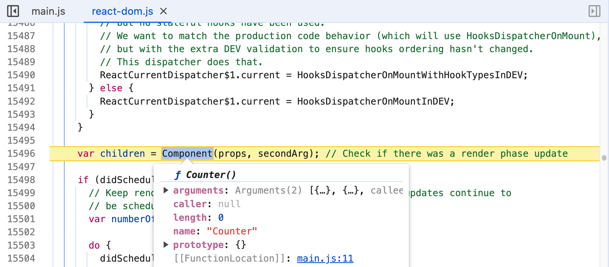

# React 엘리먼트 (Element)

React 라이브러리는 React 엘리먼트를 생성합니다.  
ReactDOM 라이브러리는 React 엘리먼트를 앱으로 렌더링합니다.

##### 실습

☑ 로컬 환경에서 React 시작하기 ([참고](https://bit.ly/4crVSSe))
☑ React CDN 호출 (참고: [react](https://unpkg.com/react/umd/react.development.js), [react-dom](https://unpkg.com/react-dom/umd/react-dom.development.js))
☑ React 엘리먼트(element) / React 앱 렌더링 이해

---

# React 엘리먼트 트리 (Elements Tree)

React 엘리먼트는 다른 엘리먼트를 포함할 수 있어, 트리 데이터 구조로 표현할 수 있습니다.

##### 실습

☑ React 엘리먼트 트리 구성
☑ React 엘리먼트와 DOM 엘리먼트 비교
☑ React 엘리먼트 생성 시점 검토 ([참고](https://mzl.la/3XoR4bX))

---

# React DOM 업데이트

선언적 프로그래밍은 항상 명령형 프로그래밍을 포함합니다.  
ReactDOM이 어떤 과정을 거쳐 React 앱을 실제 DOM에 렌더링하는 지 검토합니다.

##### 실습

☑ [react.js](https://unpkg.com/react/umd/react.development.js), [react-dom.js](https://unpkg.com/react-dom/umd/react-dom.development.js) 다운로드
☑ `react-dom.js`에서 `appendChild`, `appendChildToContainer` 코드 부분 확인

---

# React 컴포넌트 (Component)

React에서 함수 컴포넌트는 React 요소(element)를 반환하는 함수입니다.  
컴포넌트는 React에 의해 호출되며 재사용이 가능하지만 모든 컴포넌트가 재사용되는 것은 아닙니다.

##### 실습

☑ Counter 컴포넌트 작성

---

# 컴포넌트 재사용 (Reusability)

[DRY(Don't Repeat Yourself).](https://bit.ly/4eFowkL)  
컴포넌트를 재사용해 시간, 노력 및 불필요한 복잡성을 줄일 수 있습니다.

##### 실습

☑ Counter 컴포넌트 재사용
☑ 브라우저 개발도구 Sources 패널 → 중단점 설정 → 컴포넌트 렌더 플로우 검토



---

# 순수 함수 (Pure Function)

순수 함수란?

1. 입력이 동일한 경우, 출력 또한 항상 동일합니다.
1. 부수효과(Side effects)가 발생하지 않습니다.

##### 실습

☑ 순수(pure) 함수 예시 작성
☑ 불순(impure) 함수 예시 작성

---

# 컴포넌트 속성(Props)

함수를 실행할 때, 인수(arguments)를 전달받을 수 있습니다.

```js
callFn(args)
```
<br />  

마찬가지로 React 컴포넌트 또한 실행 시, 속성(properties)을 전달받을 수 있습니다.

```js
Component(props)
```

##### 실습

☑ Counter 컴포넌트 속성 설정

---

# 불변성 (Immutability)

컴포넌트에 전달된 속성(props)은 변경할 수 없습니다.  
내부적으로 [Object.freeze](https://mzl.la/2t1PEbq)에 의해 `props` 객체가 동결되기 때문입니다.

###### 실습

☑ 브라우저 개발도구 Sources 패널 → 중단점 설정 → `props` 변경 여부 관찰(watch)
☑ `react.js` 파일에서 `'freeze'`를 검색해 전달된 `props`를 동결시키는 지 확인
☑ `props`를 구조 분해 할당할 경우, 불변 상태가 아니므로 값 수정에 따라 문제 발생 가능성 확인

---

# 템플릿 로직 (Template Logic)

조건 로직에 따른 React 엘리먼트 트리 재-조정(reconciliation)  
실제 DOM 전면 교체는 상당한 비용이 들기에 리-렌더(re-render) 시, 변경된 부분만 반영

###### 실습

☑ 변수 생성 후, 조건 값 변경에 따라 앱이 리-렌더되도록 구성
☑ 리-렌더될 때 실제 DOM에는 가상 DOM 트리의 변경된 부분만 반영됨을 확인
☑ `react-dom.js`에서 `removeChild`, `removeChildFromContainer` 부분 확인

---

# DOM 엘리먼트 속성 (Element Properties)

React는 가상 DOM을 구성하는 엘리먼트 설정으로 DOM 요소에 속성(attributes)을 부여합니다.

##### 실습

☑ 실제 DOM 요소에 `class` 속성 설정
☑ React 엘리먼트에 `class` 속성 설정
